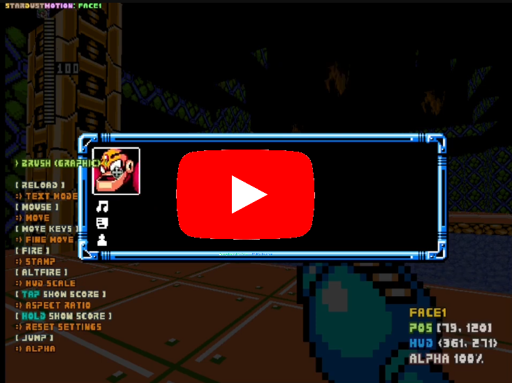
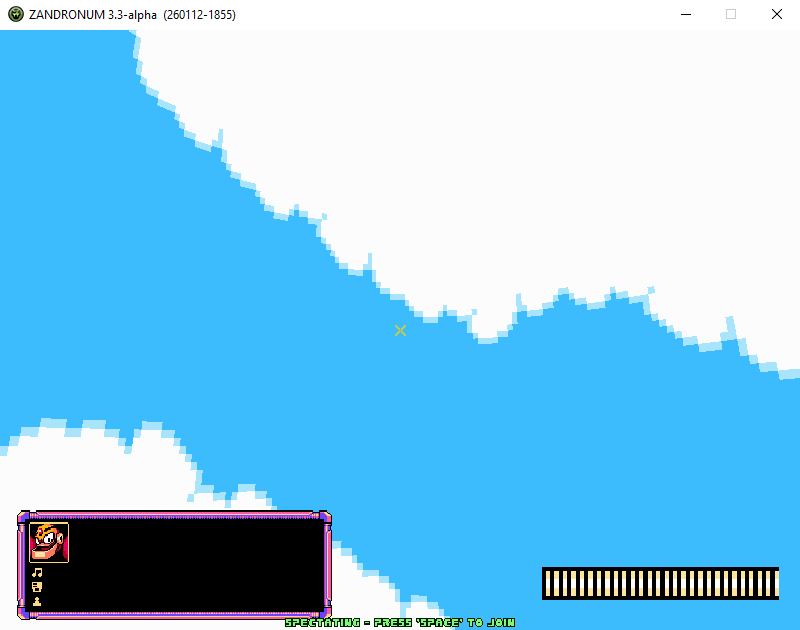
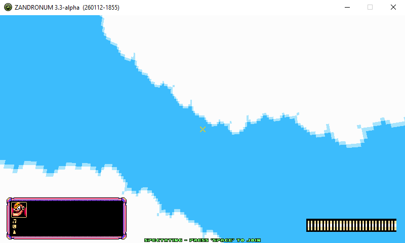
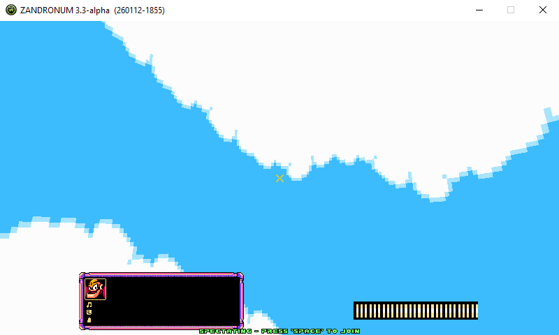
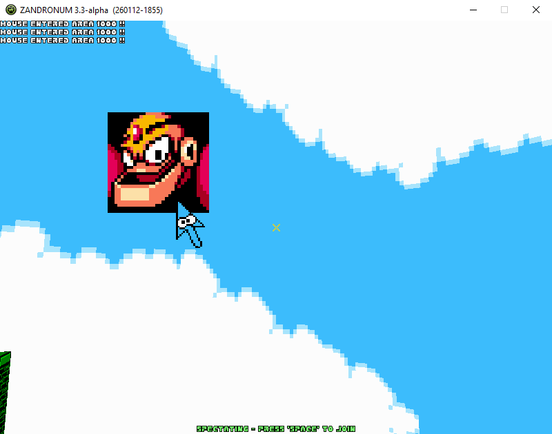
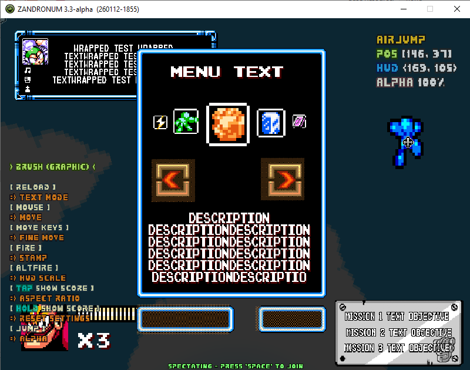
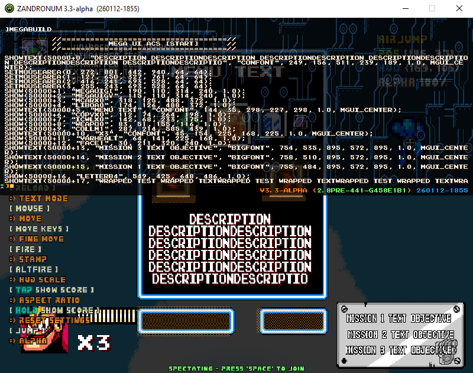

- [Zandronum thread](https://zandronum.com/forum/viewtopic.php?f=94&t=11580)
- [MM8BDM thread](https://mm8bdm.net/forum/thread/megaui-a-zandronum-ui-library-319)

## MegaUI documentation

- [Intro](#intro)
- [API](#api)
- [Features](#features)
- [Credits](#credits)

# Intro

A library made in ACS aiming for faster UI implementation, and ability to make mouse-interactable menus, in Zandronum.

### [\>\>\> Download v1.0.0\<\<\<](https://allfearthesentinel.com/zandronum/download.php?file=megaui-1.0.0.pk3) [*2026-09-19*]

### Quick showcase

Load it with Zandronum offline, start a map, then :
- Type `megagame1`, `megagame2`, `megagame3`, or `megagame4` in console to test a few minigames made with this library
- Type `megaui` in console to use the [UI Editor](#ui-editor)

### Mod integration

- **Zandronum >= 3.3 required**. Also make sure your compiler uses the latest [zdefs.acs / zspecial.acs](https://foss.heptapod.net/zandronum/acc)
- Copy [megaUI.acs](../src/acs_source/megaUI.acs) to your mod ; include it with `#include "megaUI.acs"`, and you're done
- You can check the 4 `megagameX` minigames examples' code ; and the **[API](#api)** for the functions' description

# API

### [**>>> API specification <<<**](./API.md)

# Features

## Simplified rendering

Concise, wrapper functions around `HudMessage/SetHudSize/SetFont` for one-liners. 

## Screen anchor

You can anchor graphic/text to make their **position relative to left/right side of the screen**.

It effectively makes better use of screen space on resolutions wider than 4:3.

### **[800x600 / 4:3]**

 

### **[800x450 / 16:9)** + Anchor **enabled**
 

### **[800x450 / 16:9)** + Anchor **disabled**

## Mouse Menu

You can enable a **mouse-controllable cursor on screen**.

While enabled, the cursor will send **mouse hover/exit/click** events when interacting with an area of the screen you registered.

How does your UI react is up for your mod to implement. MegaUI only handles mouse control and send mouse events. 

## UI Editor

An UI editor tool is included. 

It works like a painting software to **design your UI directly in-game**.

Start Zandronum with the MegaUI pk3 and type `megaui` in console to use it.

You can:
- Stamp graphic / text
- Draw interactable mouse areas' hitbox
- Inspect and change their position, hud size ("scale"), alpha, text wrap...
- Generate the ACS code with `megabuild` console command

### Example 

### Generated code
(Use `logfile` Zandronum command to write to disk. *You can use a tool like [this website](https://cleantextkit.com/remove-timestamps/) to trim the logs' timestamps.*)

# Credits
- Zandronum devs for the engine
- Beta testers : PinkRoboBlaster, Heelnavi
- Editor 
    - SFX from Dreamcast BIOS
    - Cursor from Kenney's cursor pixel pack
- Minigames
    - Music from Savaged Regime, Zero Wing, and Allanx
    - Resources from Stepmania assets [<1>](https://josevarela.net/SMArchive/Themes/ThemePreview.php?Category=SM3.9&ID=DDR3rd) / [<2>](https://josevarela.net/SMArchive/NoteSkins/Preview.php?Category=SM3.9&ID=ddr-ps3), Ukiyama's weapon loadout, Cutmanmike's Corruption Cards
- You for reading the docs

